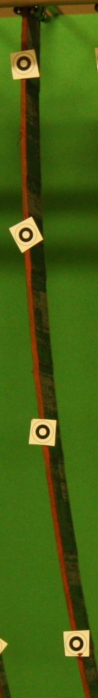
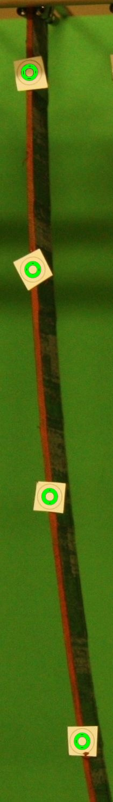
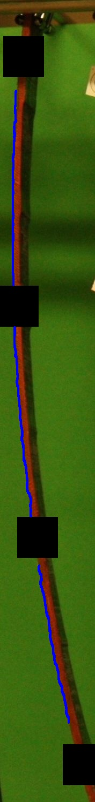

# CalculateCurvate

## Description

This program is used to find the curvature of the thermoplastic composite samples, using image like this:

The program detects the curvature of the sample using one of the approaches: either markers with concentric circles attached to the surface, or from the edge of the material.

The main motivation of creating this project was investigation of sample curvature variations along with temperature to find so-called stress-free temperature of the material. Parameter is importatn for the proper manufacturing of this type of composite. Detection method is similiar to one presented in paper (Péron, M., et al. <i> Measurement and prediction of residual strains and stresses during the cooling of a glass fibre reinforced PA66 matrix composite</i>. Compos. Part A Appl. Sci. Manuf. 2020, 137, 106039, doi:10.1016/j.compositesa.2020.106039.

## Usage

In the first step, the location of points on the length of the samples has to be found. Fot this reason, either markers or edges can be used.

`find_markers(src_img)` finds circles present in the markers of the markers on the source image (`src_img`). Function returns array of location of circles present on the markers `(x,y,R)`.

`find_sample_edges(src, threshold)` finds the edge of the sample on the source image (`src_img`). Function has second argument `threshold`, which is value of pixel intesity used to binarize the image. The function returns the array with pixels along the edge.

Later on, based on pixels locations the final circle corresponding the sample deformation can be fitted.

`fit_circle(x, y)` takes the lists of `x` and `y` of pixels and finds the best fit circle by least square method. The function returns the paramters of the fitted circle `(x,y,R)`

### Examples

In the files `calculate_from_markers.py` and `calculate_from_edge.py` are shown exemplary scripts to find curvature of all example images added to the repository

#### Support

Experiments, which resulted in exemplary images were conducted at Wrocław University of Science and Technology with help of Neha Yadav and Paweł Stabla
